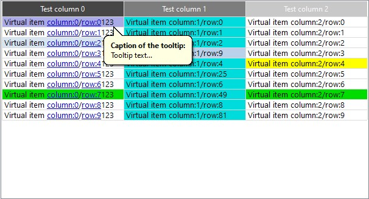
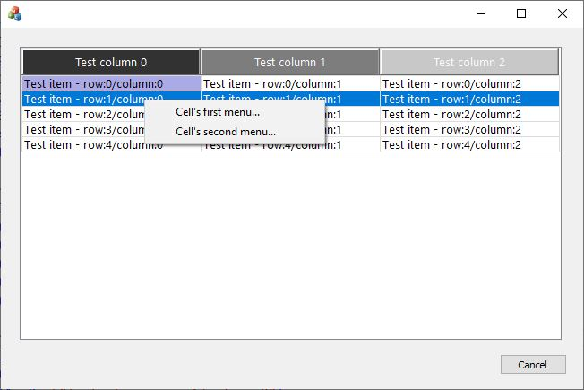

## **List control for MFC applications**


## Table of Contents
* [Introduction](#introduction)
* [Installation](#installation)
* [Create](#create)
    * [Manually](#manually)
    * [In Dialog](#in-dialog)
* [Tooltips](#tooltips)
* [Menu](#menu)
    * [Menu Example](#menu-example)
    * [Handle Menu Clicks](#handle-menu-clicks)
* [Sorting](#sorting)
   * [Virtual mode](#virtual-mode)
* [Public Methods](#public-methods)
   * [SetSortable](#setsortable)
* [Structures](#structures)
   * [LISTEXCREATESTRUCT](#listexcreatestruct)
   * [LISTEXCOLORS](#listexcolors)
   * [LISTEXCELLCOLOR](#listexcellcolor)
   * [EListExSortMode](#elistexsortmode)
* [Notification Messages](#notification-messages) <details><summary>_Expand_</summary>
   * [LISTEX_MSG_MENUSELECTED](#listex_msg_menuselected)
   * [LISTEX_MSG_CELLCOLOR](#listex_msg_cellcolor)
* [Example](#example)
* [Appearance](#appearance)

## [](#)Introduction
`IListEx` class is basically an extension of the standard **MFC** [`CMFCListCtrl`](#https://docs.microsoft.com/en-us/cpp/mfc/reference/cmfclistctrl-class?view=vs-2019#sort) class with many improvements.

### The main features of the IListEx:
* Set tooltips for individual cells that show up on mouse hover
* Set popup menu for the individual cells as well as for the whole list control
* Set background and text color for individual cells
* Set additional item data for individual cells
* Many options to set individual colors for lots of list aspects with [`LISTEXCOLORSTRUCT`](#listexcolors)
* Set header height and font, as well as color for individual header columns
* Innate ability to sort list columns with no additional efforts
* Dynamically change list font size with <kbd>Ctrl</kbd>+<kbd>MouseWheel</kbd>

## [](#)Installation
The usage of the control is quite simple:
1. Copy *ListEx* folder into your project's folder.
2. Add all files from *ListEx* folder into your project.
3. Add `#include "ListEx/ListEx.h"` where you suppose to use the control.
4. Declare `IListExPtr` variable: `IListExPtr myList { CreateListEx() };`

`IListExPtr` is, in fact, a pointer to the `IListEx` pure abstract base class, wrapped either in `std::unique_ptr` or `std::shared_ptr`. You can choose whatever is best for you by comment/uncomment one of this alliases in `ListEx.h`:
```cpp
	//using IListExPtr = IListExUnPtr;
	using IListExPtr = IListExShPtr;
```
This wrapper is used mainly for convenience, so you don't have to bother about object lifetime, it will be destroyed automatically.
That's why there is a call to the factory function `CreateListEx()`, to properly initialize a pointer.<br>

Control uses its own namespace `LISTEX`. So it's up to you, whether to use namespace prefix before declarations: 
```cpp
LISTEX::
```
or to define namespace in the source file's beginning:
```cpp
using namespace LISTEX;
```

## [](#)Create
### [](#)Manually
`Create` is the main method to create list control. It takes reference to the [`LISTEXCREATESTRUCT`](#listexcreatestruct) structure.

Below is a simple example of the **control**'s creation:
```cpp
IListExPtr myList { CreateListEx() };
.
.
LISTEXCREATESTRUCT lcs;
lcs.pwndParent = this;
lcs.nID = ID_MY_LIST;
lcs.rect = CRect(0, 0, 500, 300);

myList->Create(lcs);
```
With `LISTEXCREATESTRUCT` structure you can adjust a plethora of list’s aspects:

* Color of the list text and bk (background). Bk is set separately for odd and even rows
* Color of the list header
* Height of the list header
* Font of the list header, and font of list itself
* Color of individual header's columns
* Color of tooltip's window text and bk
* Color of the text and bk of a cell that has tooltip
* Color of list grid, and even its width
* Color of row when it's selected
* Make list sortable

### [](#)In Dialog
To create the control in a *Dialog* you can manually do it with the [Create](#manually) method.

But most of the times you prefer to place a standard *List Control* onto the *Dialog*'s template, by dragging it from the **Toolbox** within **Visual studio**.  
To use the latter approach follow these steps:
1. Put standard *List Control* from the toolbox onto your dialog template. Give it appropriate ID (`IDC_LISTEX`) and make it desirable size.
2. Declare `IListExPtr` member varable within your dialog class: `IListExPtr m_myList { CreateListEx() };`
3. In your `OnInitDialog` method call `m_myList->CreateDialogCtrl(IDC_LISTEX, this);` function.

## [](#)Tooltips
To set a tooltip for a given cell, just write:

```cpp
myList->SetCellTooltip(0, 1, L"Tooltip text", L"Tooltip caption:");
```
This will set a tooltip for cell (0, 1) with the text: **_Tooltip text_**, and the caption **_Tooltip caption_**.

## [](#)Menu
`IListEx` class possesses innate ability to set popup menu for individual cells, as well as for the whole list.



This is achieved with the help of two public methods:
```cpp
SetListMenu(CMenu* pMenu);
SetCellMenu(int iItem, int iSubitem, CMenu* pMenu);
```
### [](#)Menu Example
With the code below, we are going to set two separate menus:

* For the whole list - `CMenu m_menuList;`<br>
* For the individual cell - `CMenu m_menuCell;`
```cpp
//MyDlg.h
#include "ListEx/ListEx.h"

using namespace LISTEX;

constexpr auto IDC_LIST_MENU_CELL_FIRST = 0x1;
constexpr auto IDC_LIST_MENU_CELL_SECOND = 0x2;
constexpr auto IDC_LIST_MENU_GLOBAL_FIRST = 0x3;
constexpr auto IDC_LIST_MENU_GLOBAL_SECOND = 0x4;

class CMyDlg : public CDialogEx
{
private:
  CMenu m_menuCell;
  CMenu m_menuList;
  IListExPtr m_myList { CreateListEx() };
  //...
}

//MyDlg.cpp
CMyDlg::OnInitDialog()
{
  m_myList->CreateDialogCtrl();
  m_myList->InsertColumn(0, L"First column", 0, 100);
  m_myList->InsertColumn(...);
  m_myList->InsertItem(...);. 
  m_myList->SetItemText(...);

  m_menuCell.CreatePopupMenu();
  m_menuCell.AppendMenuW(MF_STRING, IDC_LIST_MENU_CELL_FIRST, L"Cell's first menu...");
  m_menuCell.AppendMenuW(MF_STRING, IDC_LIST_MENU_CELL_SECOND, L"Cell's second menu...");

  m_menuList.CreatePopupMenu();
  m_menuList.AppendMenuW(MF_STRING, IDC_LIST_MENU_GLOBAL_FIRST, L"List's first menu...");
  m_menuList.AppendMenuW(MF_STRING, IDC_LIST_MENU_GLOBAL_SECOND, L"List's second menu...");

  m_myList->SetListMenu(&m_menuList);
  m_myList->SetCellMenu(1, 0, &m_menuCell); //Set menu for row:1 column:0.
}
```
### [](#)Handle Menu Clicks
When user clicks a menu `IListEx` sends `WM_NOTIFY` message, with `NMITEMACTIVATE` struct pointer as `lParam`, to its parent window. So, in order to properly handle clicks you have to process this message in your list's parent window:

```cpp
BOOL CMyDialog::OnNotify(WPARAM wParam, LPARAM lParam, LRESULT* pResult)
{
    const LPNMITEMACTIVATE pNMI = reinterpret_cast<LPNMITEMACTIVATE>(lParam);

    if (pNMI->hdr.idFrom == IDC_LISTEX)
    {
    	if (pNMI->hdr.code == LISTEX_MSG_MENUSELECTED)
    	{
            CString ss;
            switch (pNMI->lParam)
            {
            case IDC_LIST_MENU_CELL_FIRST:
            ss.Format(L"Cell's first menu clicked. Row: %i, Column: %i", pNMI->iItem, pNMI->iSubItem);
            break;
            case IDC_LIST_MENU_CELL_SECOND:
                ss.Format(L"Cell's second menu clicked. Row: %i, Column: %i", pNMI->iItem, pNMI->iSubItem);
            break;
            case IDC_LIST_MENU_GLOBAL_FIRST:
                ss.Format(L"List's first menu clicked. Row: %i, Column: %i", pNMI->iItem, pNMI->iSubItem);
            break;
            case IDC_LIST_MENU_GLOBAL_SECOND:
                ss.Format(L"List's second menu clicked. Row: %i, Column: %i", pNMI->iItem, pNMI->iSubItem);
            break;
            }
            MessageBoxW(ss);
        }
    }
    return CDialogEx::OnNotify(wParam, lParam, pResult);
}
```
`IListEx` fills `NMITEMACTIVATE` struct with `NMITEMACTIVATE::hdr.code` equals `LISTEX_MSG_MENUSELECTED`. And `menuId` is stored as `NMITEMACTIVATE::lParam`.

`NMITEMACTIVATE::iItem` and `NMITEMACTIVATE::iSubItem` both point to a cell the menu was clicked on.

## [](#)Sorting
To enable sorting set the [`LISTEXCREATESTRUCT::fSortable`](#listexcretestruct) flag to true. In this case, when you click on the header, list will be sorted according to the clicked column. By default `IListEx` performs lexicographical sorting.

To set your own sorting routine use [`SetSortable`](#setsortable) method. 

### [](#)Virtual mode
In virtual list mode, if created with `LVS_OWNERDATA` style, `IListEx` will notify, in form of `WM_NOTIFY` message, parent window with `NMHDR::code` equal to `LVN_COLUMNCLICK` when user clicked header column.

`LVM_MAPINDEXTOID` message code will be sent to notify parent window that `IListEx::MapIndexToID` method was called internally. Parent window in this case is responsible to provide unique IDs for list items. This is very important for cells individual colors, tool-tips, menu and custom data to work properly in virtual mode.  
Unique ID must be returned in form of `LPNMITEMACTIVATE::lParam`
```cpp
BOOL CMyDlg::OnNotify(WPARAM wParam, LPARAM lParam, LRESULT * pResult)
{
    const LPNMITEMACTIVATE pNMI = reinterpret_cast<LPNMITEMACTIVATE>(lParam);

    if (pNMI->hdr.idFrom == IDC_LISTEX)
    {
    	switch (pNMI->hdr.code)
    	{
    	case LVM_MAPINDEXTOID:
    		pNMI->lParam = //Unique ID of the pNMI->iItem.
    	break;
    	//...
    	}
    }
}
```

## [](#)Public Methods
`IListEx` class also has a set of additional public methods to help customize your control in many different aspects.
```cpp
virtual bool Create(const LISTEXCREATESTRUCT& lcs) = 0;
virtual void CreateDialogCtrl(UINT uCtrlID, CWnd* pwndDlg) = 0;
virtual BOOL DeleteAllItems() = 0;
virtual BOOL DeleteColumn(int nCol) = 0;
virtual BOOL DeleteItem(int nItem) = 0;
virtual void Destroy() = 0;
[[nodiscard]] virtual ULONGLONG GetCellData(int iItem, int iSubitem)const = 0;
[[nodiscard]] virtual EListExSortMode GetColumnSortMode(int iColumn)const = 0;
[[nodiscard]] virtual UINT GetFontSize()const = 0;
[[nodiscard]] virtual int GetSortColumn()const = 0;
[[nodiscard]] virtual bool GetSortAscending()const = 0;
[[nodiscard]] virtual bool IsCreated()const = 0;
virtual void SetCellColor(int iItem, int iSubitem, COLORREF clrBk, COLORREF clrText = -1) = 0;
virtual void SetCellData(int iItem, int iSubitem, ULONGLONG ullData) = 0;
virtual void SetCellMenu(int iItem, int iSubitem, CMenu* pMenu) = 0;
virtual void SetCellTooltip(int iItem, int iSubitem, std::wstring_view wstrTooltip, std::wstring_view wstrCaption = L"") = 0;
virtual void SetColor(const LISTEXCOLORS& lcs) = 0;
virtual void SetColumnColor(int iColumn, COLORREF clrBk, COLORREF clrText = -1) = 0;
virtual void SetColumnSortMode(int iColumn, EListExSortMode enSortMode) = 0;
virtual void SetFont(const LOGFONTW* pLogFontNew) = 0;
virtual void SetFontSize(UINT uiSize) = 0;
virtual void SetHdrHeight(DWORD dwHeight) = 0;
virtual void SetHdrFont(const LOGFONTW* pLogFontNew) = 0;
virtual void SetHdrColumnColor(int iColumn, COLORREF clrBk, COLORREF clrText = -1) = 0;
virtual void SetListMenu(CMenu* pMenu) = 0;
virtual void SetRowColor(DWORD dwRow, COLORREF clrBk, COLORREF clrText = -1) = 0;
virtual void SetSortable(bool fSortable, PFNLVCOMPARE pfnCompare = nullptr,
			EListExSortMode enSortMode = EListExSortMode::SORT_LEX) = 0;
```

### [](#)SetSortable
```cpp
void SetSortable(bool fSortable, PFNLVCOMPARE pfnCompare = nullptr, EListExSortMode enSortMode = EListExSortMode::SORT_LEX)
```
**Parameters:**  

`bool fSortable`  
Enables or disables sorting

`PFNLVCOMPARE pfnCompare`  
Callback function pointer with type `int (CALLBACK *PFNLVCOMPARE)(LPARAM lParam1, LPARAM lParam2, LPARAM lParamSort)` that is used to set your own comparison function. If it's `nullptr` `IListEx` performs default sorting.  
The comparison function must be either a static member of a class or a stand-alone function that is not a member of any class. For more information see official [MSDN documentation](https://docs.microsoft.com/en-us/cpp/mfc/reference/clistctrl-class?view=vs-2019#remarks-100).

`EListExSortMode enSortMode`  
Default sorting mode for the list.

## [](#)Structures

### [](#)LISTEXCREATESTRUCT
```cpp
struct LISTEXCREATESTRUCT {
    LISTEXCOLORS      stColor { };           //All control's colors.
    CRect             rect;                  //Initial rect.
    CWnd*             pwndParent { };        //Parent window.
    const LOGFONTW*   pListLogFont { };      //List font.
    const LOGFONTW*   pHdrLogFont { };       //Header font.
    DWORD             dwStyle { };           //Control's styles. Zero for default.
    UINT              uID { };               //Control Id.
    DWORD             dwListGridWidth { 1 }; //Width of the list grid.
    DWORD             dwHdrHeight { 20 };    //Header height.
    bool              fSortable { false };   //Is list sortable, by clicking on the header column?
    bool              fDialogCtrl { false }; //If it's a list within dialog.
};
```

### [](#)LISTEXCOLORS
```cpp
struct LISTEXCOLORSTRUCT
{
    COLORREF clrListText { GetSysColor(COLOR_WINDOWTEXT) };            //List text color.
    COLORREF clrListBkRow1 { GetSysColor(COLOR_WINDOW) };              //List Bk color of the odd rows.
    COLORREF clrListBkRow2 { GetSysColor(COLOR_WINDOW) };              //List Bk color of the even rows.
    COLORREF clrListGrid { RGB(220, 220, 220) };                       //List grid color.
    COLORREF clrListTextSelected { GetSysColor(COLOR_HIGHLIGHTTEXT) }; //Selected item text color.
    COLORREF clrListBkSelected { GetSysColor(COLOR_HIGHLIGHT) };       //Selected item bk color.
    COLORREF clrTooltipText { GetSysColor(COLOR_INFOTEXT) };           //Tooltip window text color.
    COLORREF clrTooltipBk { GetSysColor(COLOR_INFOBK) };               //Tooltip window bk color.
    COLORREF clrListTextCellTt { GetSysColor(COLOR_WINDOWTEXT) };      //Text color of a cell that has tooltip.
    COLORREF clrListBkCellTt { RGB(170, 170, 230) };                   //Bk color of a cell that has tooltip.
    COLORREF clrHdrText { GetSysColor(COLOR_WINDOWTEXT) };             //List header text color.
    COLORREF clrHdrBk { GetSysColor(COLOR_WINDOW) };                   //List header bk color.
    COLORREF clrHdrHglInactive { GetSysColor(COLOR_GRADIENTINACTIVECAPTION) };//Header highlight inactive.
    COLORREF clrHdrHglActive { GetSysColor(COLOR_GRADIENTACTIVECAPTION) };    //Header highlight active.
    COLORREF clrBkNWA { GetSysColor(COLOR_WINDOW) };                   //Bk of non working area.
};
```
This struct is also used in `SetColor` method.

### [](#)LISTEXCELLCOLOR
```cpp
struct LISTEXCELLCOLOR
{
	COLORREF clrBk { };
	COLORREF clrText { };
};
using PLISTEXCELLCOLOR = LISTEXCELLCOLOR*;
```
Used as a response to `LISTEX_MSG_CELLCOLOR` message.

### [](#)EListExSortMode
Enum showing sorting type for list columns.
```cpp
enum class EListExSortMode : short
{
    SORT_LEX, SORT_NUMERIC
};
```

## [](#)Notification Messages
These messages are sent to the parent window in form of `WM_NOTIFY` windows message.  
The `lParam` will contain pointer to `NMHDR` standard windows struct. `NMHDR::code` can be one of the `LISTEX_MSG_...` messages described below.
### [](#)LISTEX_MSG_MENUSELECTED
User defined menu selected. See [menu](#menu) section.

### [](#)LISTEX_MSG_CELLCOLOR
Sent to the parent to retrieve current cell color. You can set cells' colors whether handling this message or using [`SetCellColor`](#setcolor) member function.  
This message has higher priority over `SetCellColor` method.
   
## [](#)Example
Let’s imagine that you need a list control with a non standard header height, and yellow background color.
Nothing is simpler, see code below:
```cpp
LISTEXCREATESTRUCT lcs;
lcs.rect = CRect(0, 0, 500, 300)
lcs.pwndParent = this;
lcs.dwHdrHeight = 50;
lcs.stColor.clrListBkRow1 = RGB(255, 255, 0);
lcs.stColor.clrListBkRow2 = RGB(255, 255, 0);

myList->Create(lcs);

myList->InsertColumn(...);
myList->InsertItem(...);
```
Here, we set both - even and odd rows (`clrListBkRow1` and `clrListBkRow2`) to the same yellow color.

## [](#)Appearance
With the **Ctrl+MouseWheel** combination you can dynamically change list's font size.